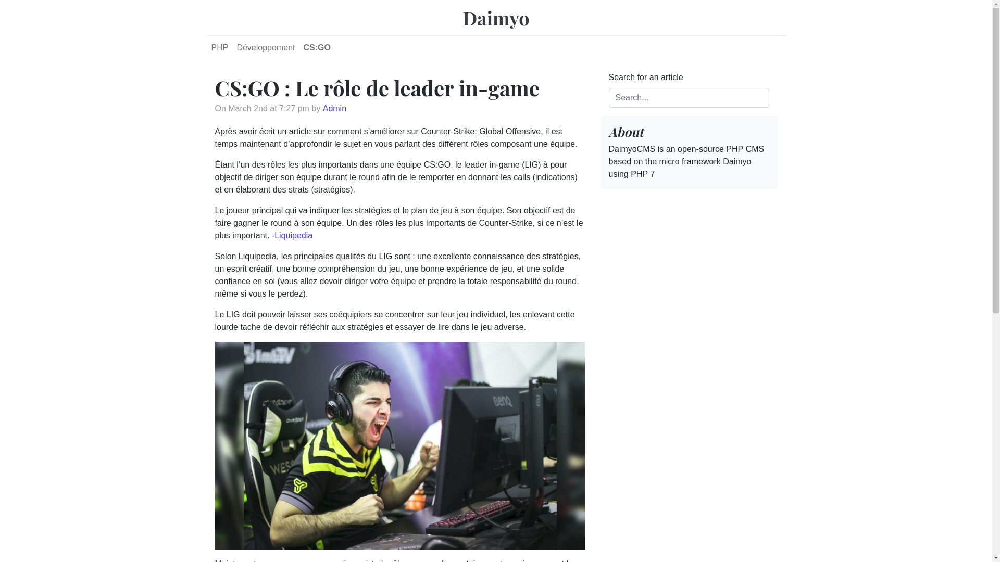
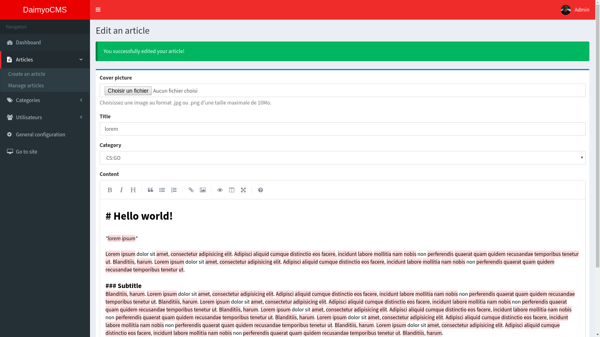
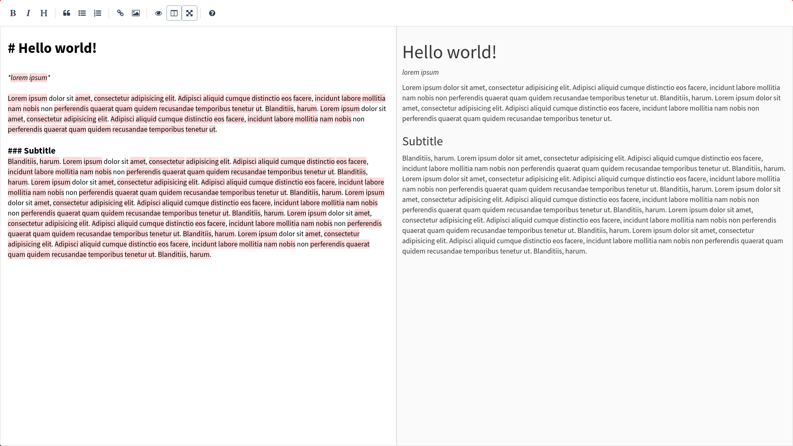

  

  
  
  
  

<strong>Deprecated in production : this project is not maintained anymore.</strong>

DaimyoCMS is an open-source Micro CMS based on the micro framework <a href="https://github.com/SundownDEV/Daimyo">Daimyo</a> using PHP 7.

## Features
* Manage content such as users, articles and categories...
* Markdown editor
* Easy to customize
* Templating using Twig
* Lightweight and secure

## Why DaimyoCMS ?
You may ask why should you use this CMS while there's a lot of other popular ones, what makes this CMS better than another one ? Well, nothing. I created DaimyoCMS to handle tiny personal projects and code in my way as a junior developer. If you are looking for a minimal and micro php framework based CMS, you're on the right way. DaimyoCMS is just part of my personal R&D. Feel free to give it a review or contribute!

DaimyoCMS is fast, secure and lightweight, but also basic in features.

## Development
- [x] Templating
  - [x] Default blog template
  - [x] Default admin dashboard template
- [ ] Administration
  - [x] Admin login feature
  - [x] Manage articles
  - [x] Manage categories
  - [ ] Manage users
  - [ ] User role feature (Admin, Writer)
  - [x] Markdown editor
  - [ ] Image conversion & compression
  - [x] General configuration settings
  - [x] User settings
- [x] Blog
  - [x] Read articles
  - [x] Search feature
- [ ] Documentation
  - [x] Get started
  - [ ] Admin dashboard
  - [ ] Overview
  - [x] Routing
  - [x] Templating
  - [x] Exploited PDO class
  - [x] File upload
  - [ ] Data validation
- [ ] Unit tests

## Requirement
* PHP >= 7.1
  * php7.*-gd
* MySQL >= 5.7
* Composer

**You need to install (or enable in php.ini) PHP "file info" extension.**

# Documentation
* [Get started](docs/GetStarted.md)
* [Admin dashboard](docs/AdminPanel.md)

#### Developers
* [Overview](docs/Overview.md)
* [Routing](docs/Routing.md)
* [Templating](docs/Templating.md)
* [Exploited PDO Class](docs/PDOClass.md)
* [File upload](docs/UploadClass.md)
* [Validation](docs/ValidatorClass.md)
